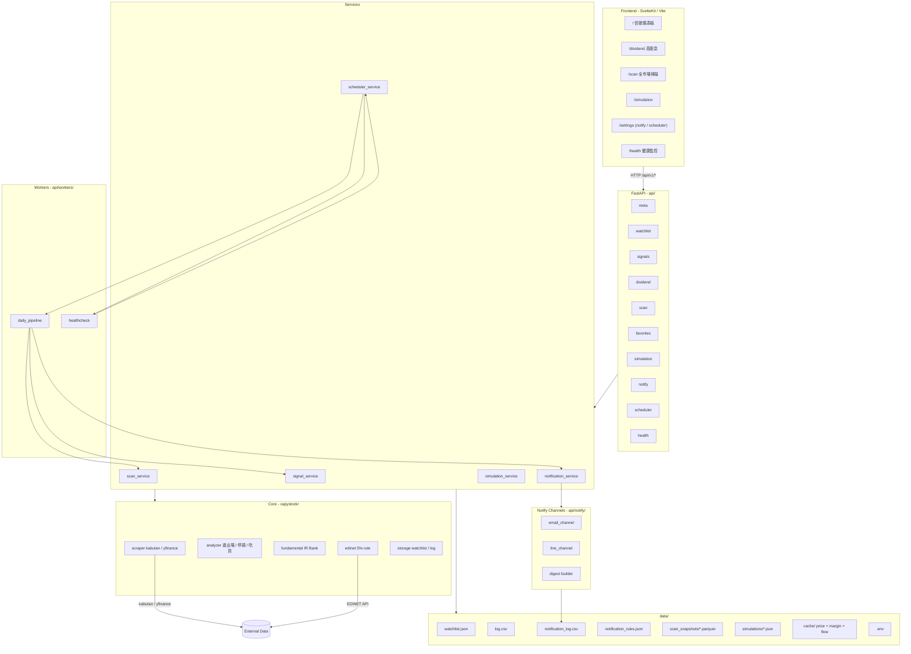

# CapyStock — 架構文件

## 模組關係（Mermaid）



## 啟動流程

1. `uvicorn api.main:app` 啟動 → `lifespan` hook
2. 預設啟動 `scheduler_service.start()`（除非 `CAPYSTOCK_SCHEDULER_DISABLED=1`）
3. 排程器註冊 jobs：`daily_pipeline`、`healthcheck_ping`、`paper_advance`
4. FastAPI mount：
   - `/api/v1/*` → 各 router
   - `/` → `frontend/dist`（StaticFiles, html=True）

## daily_pipeline 流程

```
today = date.today()
1. 若 signals snapshot 不存在 → run_signals_scan
2. analyze_watchlist → {code: [alerts]}
3. 對每個 critical alert → process_realtime_alert（去重 24h）
4. process_daily_digest（依 rule 中 last_run 控制 idempotent）
```

## 部署形態

| 模式 | 進程 | 排程 |
|---|---|---|
| Local Python | `uvicorn` 單一進程 | in-process APScheduler |
| Docker | container | in-process APScheduler |
| Windows Service (NSSM) | service 包 uvicorn | in-process APScheduler 或外部 Task Scheduler 呼叫 `python -m api.workers.daily_pipeline` |

## 資料流向總覽

| 來源 | 走哪 | 落地 |
|---|---|---|
| kabutan / yfinance | scraper | `data/cache/{CODE}_*.csv` |
| EDINET | edinet 模組 | `data/cache/edinet/` |
| 全市場掃描 | scan_service | `data/scan_snapshots/{kind}_{date}.parquet` |
| 模擬交易 | simulation_service | `data/simulations/{uuid}.json` |
| 通知 | notification_service | `data/notification_log.csv` |
| 排程 run | scheduler_service | `data/scheduler_runs.csv` |

## 設定檔

| 檔案 | 內容 | 是否 commit |
|---|---|---|
| `data/.env` | secret（SMTP/LINE/EDINET key） | ❌ |
| `data/watchlist.json` | 追蹤股票 | ❌ |
| `data/notification_rules.json` | 通知規則 | ❌ |
| `capystock/config.py` | 演算法參數（停損％等） | ✅ |
| `Dockerfile` / `docker-compose.yml` / `Makefile` | 部署 | ✅ |
